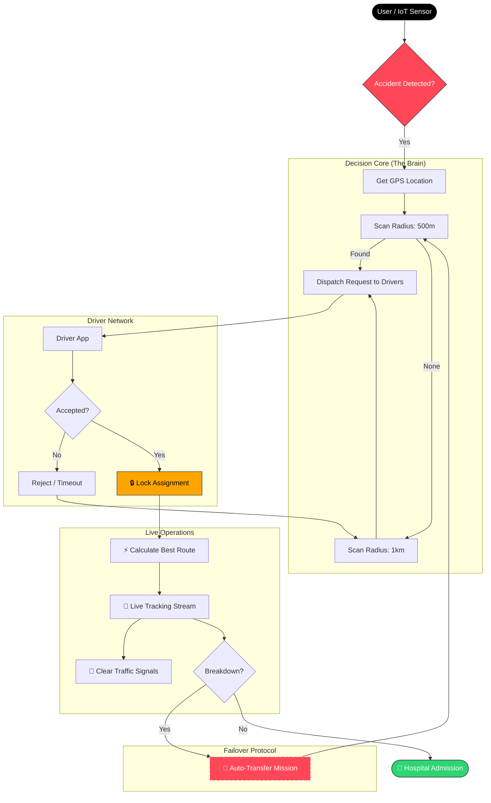

# SaHaay: India's First Autonomous Emergency Response Grid


-red?style=for-the-badge)


> **"No patient left waiting."**
>
> SaHaay transforms emergency response from a manual, opaque phone-system into a **real-time, data-driven, and fully autonomous rescue capability**.

---

## 📉 The Critical Gap

In the Golden Hour, certainty saves lives. Yet, India's current infrastructure relies on manual coordination, leading to fatal delays.

| Current System (108/112) ❌ | SaHaay Autonomous Grid ✅ |
| :--- | :--- |
| **Manual Dispatch** via Call Centers | **Instant AI Dispatch** (< 200ms) |
| **Blind Waiting** (No Tracking) | **Live Uber-style Tracking** |
| **Single Point of Failure** | **Self-Healing Failover** (Breakdown/Traffic) |
| **Network Dependent** | **Offline SMS-First Mechanism** |
| **Opaque Operations** | **Full Digital Audit Trail** |

---

## 🧠 Autonomous Architecture

SaHaay replaces human guesswork with intelligent orchestration. The system autonomously manages the entire lifecycle of an emergency—from detection to hospital admission.



---

## 🔥 Key Capabilities

### 1. ⚡ Intelligent Dispatch Engine
- **Nearest-First Logic**: Automatically pings ambulances within 500m. Expands to 1km+ dynamically if no response is received within 120 seconds.
- **Race Condition Handling**: The first driver to "Accept" locks the mission; others are instantly released.

### 2. 🛡️ Self-Healing Failover
- **Breakdown Protection**: If an ambulance halts unexpectedly or reports a breakdown, the system **automatically** re-triggers the dispatch process from the ambulance's current location to find a replacement vehicle.
- **No Human Intervention**: The transfer happens computationally, separate from the driver's panic.

### 3. 📡 Disaster-Ready Offline Mode (DIL)
- **Zero-Internet/Data Protocol**: Uses a specialized GSM/SMS transport layer.
- **Protocol**: `SOS|UID:123|LAT:28.6|LON:77.2`
- **Mechanism**: The backend runs a "Clockless" state machine that sequences SMS packets to reconstruct the emergency state even during network blackouts.

### 4. 🚦 Green Corridor Integration
- **Traffic Pre-emption**: Integration with Smart City APIs to turn signals green along the ambulance's calculated route.

---

## 🛠️ Technology Stack

| Layer | Component | Technology |
| :--- | :--- | :--- |
| **Mobile** | User / Driver Apps | **React Native** (Cross-Platform) |
| **Core** | Backend Logic | **Node.js / Express** (Event-Driven) |
| **Data** | State Store | **MongoDB** (Geo-Spatial Indexing) |
| **Real-Time** | Live Updates | **Socket.io** (WebSockets) |
| **Offline** | Transport Layer | **GSM / SMS Gateway (Twilio/Sim)** |
| **Mapping** | GIS / Routing | **Google Maps Platform** |

---

## 🚀 Deployment & Scalability

SaHaay is designed as a **Cloud-Native Microservices** architecture, capable of horizontal scaling to support nation-wide deployment.

- **State-Level Sharding**: Data is partitioned by region (e.g., `db_maharashtra`, `db_karnataka`) for low-latency access.
- **Containerization**: All services are Dockerized for rapid deployment across AWS/Azure or on-premise Government Data Centers.

### Quick Start (Simulator)

```bash
# 1. Clone the repository
git clone https://github.com/Ahad-Dngwala/SAHAAY.github.io.git

# 2. Install Dependencies
npm install

# 3. Start Mission Control (Backend + Simulator)
npm start

# 4. Launch Offline Simulation (No Internet)
# Open http://localhost:3000/citizen.html to trigger SOS via simulated GSM
```

---

## 🏆 Project Status

- [x] **Core Dispatch Logic** (Nearest Neighbor)
- [x] **Driver Allocation Algorithm**
- [x] **Live GPS Tracking**
- [x] **Offline SMS Transport Layer** (Pure GSM)
- [ ] Traffic Light Integration (API Pending)

---

> Made with ❤️ by Team SECRET CODERS. **Built for India.** Saving lives, one millisecond at a time.
